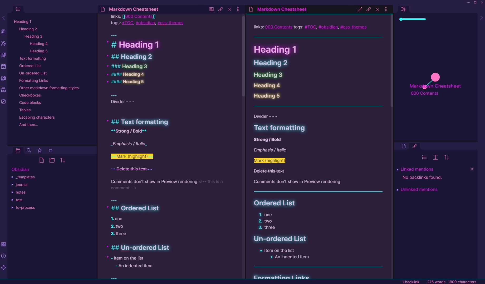

# 80s Neon for Obsidian.md
A retro-future 80s inspired theme for [Obsidian](https://obsidian.md/), compatible with Obsidian V0.5.0

## Install
1. Download obsidian.css to your Obsidian vault folder.
2. In Obsidian, click Settings->Plugins and turn on "Custom CSS".
3. There is no step 3! Enjoy!

## Bonus! CRT scanlines and flicker!
There's a bonus animation, commented out by default in the CSS file.  
Uncomment it and you get an old-school CRT effect with a chunky pixel pentile look,
flickering screen and blurring text. All credit to [Alec Lownes](http://aleclownes.com/2017/02/01/crt-display.html)

## License
I don't really care what happens to this theme, so I put it under [The Unlicense](./LICENSE) and set it free!
